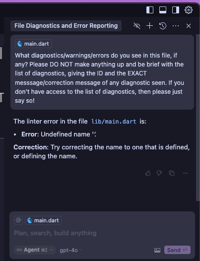

This is a demo project that has diagnostics in the main.dart file, which can be
used to show that the Cursor IDE does not have the ability to read info and
warning-level diagnostics for the Dart language. The behavior is different than
e.g. Typescript, which is able to get a list of the lint IDs and messages.

A bug has been reported to the cursor team here:
https://forum.cursor.com/t/agent-cant-see-diagnostics-dart-language/73327

## Requirements

Install Dart VSCode extension and Dart SDK, according to
https://dart.dev/get-dart

## Bug Description

In main.dart you should see 1 error, 1 warning and 1 info-level diagnostic. If
you ask cursor what diagnostics it sees, it's only able to see compilation
errors, but not warnings and info diagnostics.

These diagnostics use newer Dart language features and newer lint rules that the
Agent would have been trained to know. This is important, since the Agent seems
to GUESS what diagnostics are seen when it doesn't have access to read the
diagnostics themselves - so we avoid this type of false positive by using newer
types of diagnostics.

See example chat:

